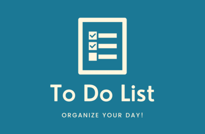

# To Do List

## Table of Contents
1. [Demo](#demo) 
2. [General info](#general-info)
3. [Technologies](#technologies)

## Demo
https://karolciesluk.github.io/toDoList/

## General info
**To Do List** is an app that helps with organizing tasks. You may list as many tasks as you wish and tick boxes when they are done or remove them by clicking on the 🗑 button.

The app was made during my participation in the [YouCode](https://youcode.pl/frontend-developer/) frontend developer course.

## Technologies
- HTML
- Javascript
- CSS
    - Flexbox
    - BEM

